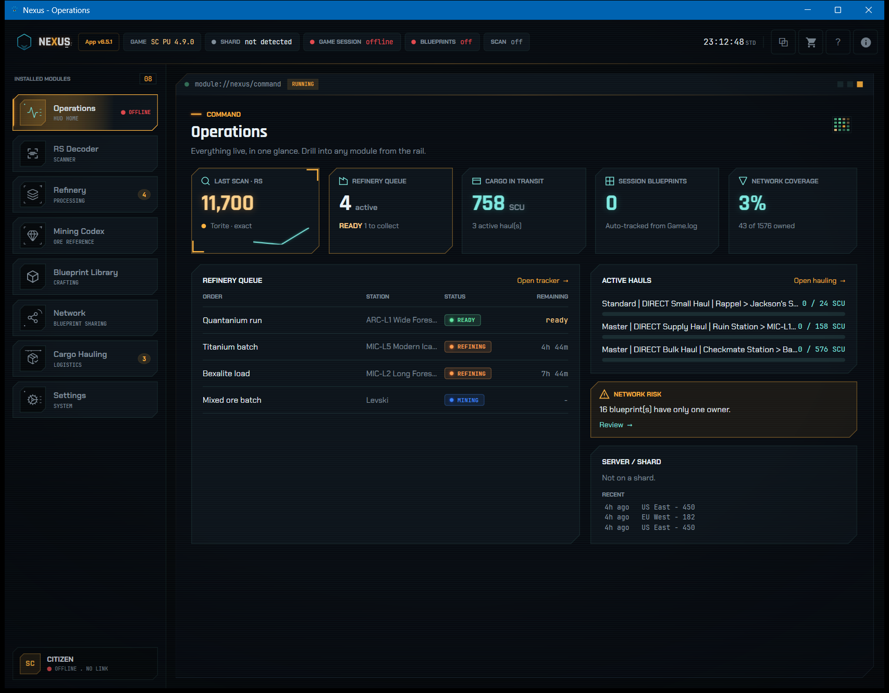
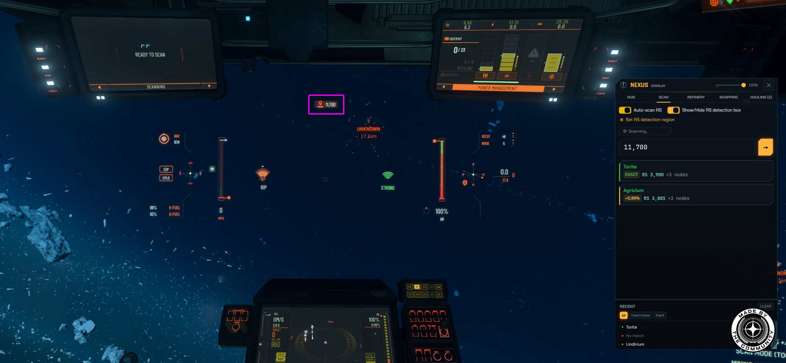
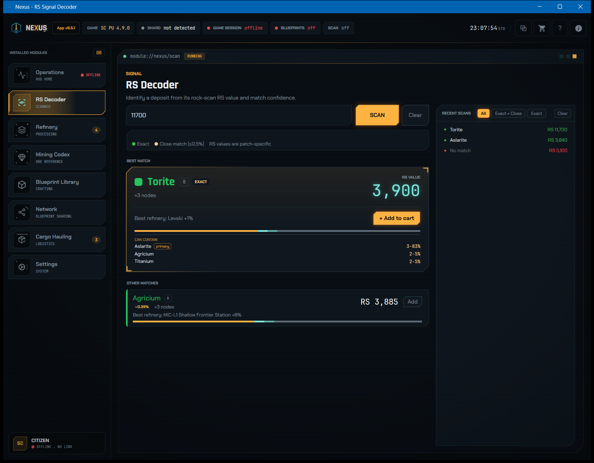
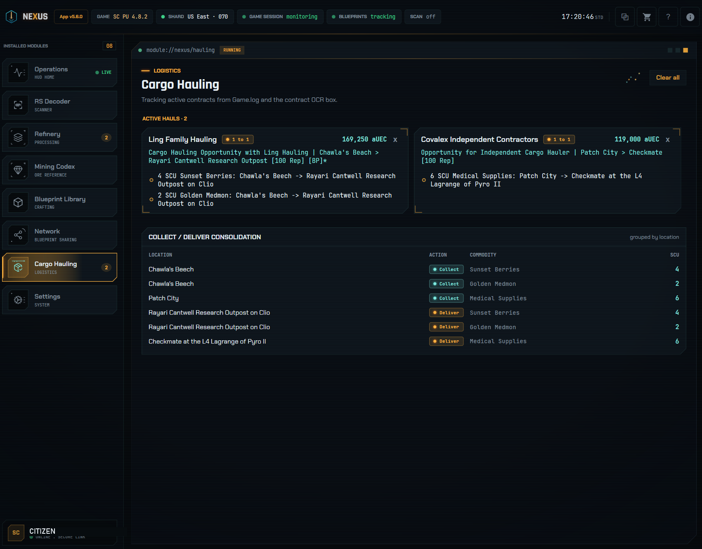
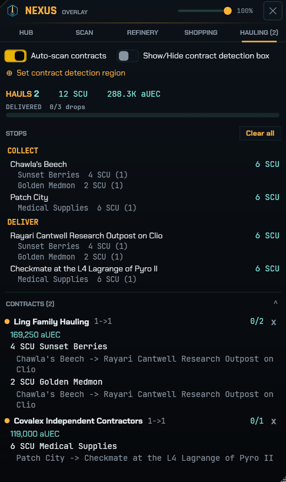

# Nexus - Star Citizen Companion App

<p align="center">
  
</p>

<p align="center">
  <picture>
    <source media="(prefers-color-scheme: dark)" srcset="docs/made-by-the-community-white.png">
    
  </picture>
</p>

**Nexus is an offline, EAC-safe companion app for the mine, refine, craft, and haul loop in Star Citizen.**

Nexus decodes RS scan values into a resource type and a node count. It times your refinery jobs. It also works as a searchable reference for resources, blueprints, and the blueprints that you own.

Nexus reads `Game.log` for two purposes. It auto-collects blueprints the moment that you unlock them. It also merges your accepted hauling contracts into one consolidated route of pickup stops and delivery stops. An overlay shows all of this and floats over the game. Nexus works fully offline.

The **Blueprint Network** adds ownership tracking for friends or your org. You trade library files, and then everyone sees who owns what.

> **Disclaimer:** Nexus is an unofficial, fan-made tool. Nexus has no affiliation with Cloud Imperium Games (CIG) or Roberts Space Industries (RSI). CIG and RSI do not endorse or sponsor Nexus. Star Citizen®, Roberts Space Industries® and Cloud Imperium® are registered trademarks of Cloud Imperium Rights LLC.

> **EAC-safe by design:** Nexus runs fully outside Star Citizen. It does not inject code. It does not read memory. It does not modify game files.
>
> Nexus does only two operations. It captures your screen with the standard Windows OCR APIs. It reads the plain-text `Game.log` that the game writes to disk. It opens `Game.log` as read-only and in shared mode.
>
> Nexus installs per-user. It runs fully offline. The whole pipeline is open source in this repo. Easy Anti-Cheat has nothing to flag.

## Features

| Page | What it does |
|------|--------------|
| **Operations** | The landing dashboard. It shows your last scan, the refinery queue, cargo in transit, session blueprints, and network coverage. It links to every module. |
| **RS Signal Decoder** | Enter an RS value by hand, or use **auto-scan**. Nexus identifies the resource and the node count. |
| **Refinery Tracker** | Track your active refinery jobs. Nexus shows live countdown timers and status indicators. |
| **Mining Codex** | A full reference table of all mineable resources. Filter it by system (Stanton / Pyro / Nyx) and by method (Ship / ROC / FPS). |
| **Blueprint Library** | Search ship, weapon, armor, and ammo blueprints. See the raw resources that each one needs. Mark the blueprints that you own. Filter by owned or not owned. |
| **Blueprint Network** | Share the blueprints that you own with friends or your org. Trade library files to do this. See who in your group owns what: coverage, the gaps to farm, and single-owner risk. Nexus works fully offline. You exchange files, and nothing syncs. |
| **Cargo Hauling** | The hauling contracts that you accept in-game appear automatically from `Game.log`. Nexus consolidates them into collect stops and deliver stops for each location. An optional screen-scan adds the reward, the contractor, and the cargo details to each haul. |

**Highlights**

- **Auto-scan overlay:** Draw a region over the RS value on your screen. Nexus then reads the value automatically with the native OCR engine in Windows.
- **Overlay:** The overlay floats over the game. You can move it and dim it as you prefer.
- **Blueprint ownership tracking:** Mark the blueprints that you own. Filter the library by owned or not owned. Track your collection completion for each category. Then you do not need to check in-game.
- **Session Tracking:** Nexus reads your Star Citizen `Game.log`. It marks blueprints as Owned automatically the moment that you receive them in-game. It can also import everything that you already unlocked from past logs. Session Tracking is always on and read-only. It never writes to or modifies any game file.
- **Cargo Hauling:** Accepted contracts appear on their own. Nexus makes a consolidated collect-and-deliver plan across all active hauls. It tracks the live shard. It cleans up automatically when you change shards.
- **Guided tour and built-in user guide:** A welcome tour guides new users through Nexus. You can replay the tour anytime from Help. A searchable help guide covers every module.
- **Blueprint Network:** Pool your owned-blueprint library with friends or your org. Trade files to see group coverage, gaps, and single-owner risk. See the full details in the Blueprint Network section below.
- **Shopping list:** Add resources or blueprint ingredients. Nexus then highlights them in scan results and history.
- **Persistent work orders:** Refinery timers survive when Nexus restarts.
- Fully **offline:** You do not need an account or an internet connection. Nexus stores settings and work orders locally on your PC.

## Screenshots

### Operations
The landing dashboard during a live session. It shows the last scan decoded, the refinery queue with one order ready, cargo in transit, and your current shard. It links to every module.

[](docs/screenshots/operations.png)

### Auto-scan, in the cockpit
The overlay SCAN tab sits over Star Citizen during mining. The detection box surrounds the in-game RS readout. Nexus decodes the value live: it identifies **RS 11,700** as **Torite** (RS 3,900 x3 nodes, exact). The scan history fills in below.

[](docs/screenshots/overlay-scan.png)

### Overlay HUB over the game
The HUB tab floats over gameplay. It shows green status lights for session tracking and both scanners, the blueprints collected this session, and your current server and shard. Everything is read-only.

[](docs/screenshots/overlay.jpg)

### RS Signal Decoder
Type any RS value to get a ranked breakdown. The best match shows as a hero card with the node count and the refinery yield. Close matches show below. The re-runnable scan history shows on the right.

[](docs/screenshots/rs-decoder.png)

### Blueprint Library
Open any blueprint to see its full bill of materials and the contracts that unlock it. It also shows a ranked WHERE TO MINE plan for the ingredients. Track everything that you own.

[](docs/screenshots/blueprint-library.png)

### Blueprint Network
Group coverage: the coverage ring, per-member ownership, and a watch list. The watch list shows the gaps that nobody owns yet and the single-owner blueprints at risk.

[](docs/screenshots/blueprint-network.png)

### Mining Codex
A full reference of every mineable resource. It is searchable. Filter it by star system (Stanton / Pyro / Nyx) and by mining method (Ship / ROC / FPS). A detail panel shows the RS value, refinery yields, locations, and the blueprints that use it.

[](docs/screenshots/mining-codex.png)

### Refinery Tracker
Live work orders show as cards. One is ready to collect. One is mid-refine, and its countdown runs. The timers survive when Nexus restarts.

[](docs/screenshots/refinery-tracker.png)

### Cargo Hauling
Nexus tracks two live contracts automatically from `Game.log` and shows their rewards. The consolidated collect and deliver table turns every leg into one route plan for each location.

[](docs/screenshots/cargo-hauling.png)

### Overlay HAULING tab
The same haul plan appears in-game. It shows totals, consolidated stops, and per-contract progress. You do not need to leave the pilot seat.

[](docs/screenshots/overlay-hauling.png)

## Installation (end users)

Nexus comes in two forms. Choose the one that suits you. Both forms are self-contained, because Nexus bundles the .NET runtime. Both need no admin rights. Both store settings and work orders locally. Both run fully offline.

### Option 1 - Installer (`Nexus_Setup.exe`) - *recommended, user friendly*

A guided setup installs Nexus like normal Windows software.

1. Download **`Nexus_Setup.exe`** from the [Releases](../../releases) page.
2. Right-click `Nexus_Setup.exe`.
3. Select **Properties**.
4. Check **Unblock** at the bottom of the dialog.
5. Click **OK**.
6. Run `Nexus_Setup.exe`.
7. Follow the prompts.
8. Optional: to make a desktop shortcut, select **Create a desktop shortcut**.
9. Open Nexus from the Start menu or the desktop.

### Option 2 - Portable (standalone `NexusApp.exe`)

Run Nexus directly. You do not need to install it.

1. Download **`NexusApp_portable.zip`** from the [Releases](../../releases) page.
2. Right-click `NexusApp_portable.zip`.
3. Select **Properties**.
4. Check **Unblock** at the bottom of the dialog.
5. Click **OK**.
6. Right-click `NexusApp_portable.zip` again.
7. Select **Extract All…**.
8. Choose a location, for example the Desktop or Documents.
9. Open the extracted folder.

**Caution:** Keep all the files in the extracted folder together.

10. Double-click **`NexusApp.exe`** to start Nexus.

> **Windows SmartScreen note (applies to both options):** Nexus is unsigned. Code-signing certificates cost several hundred dollars a year. Because Nexus is unsigned, Windows can show a blue *"Windows protected your PC"* dialog on the first run. To continue, click **More info**, then click **Run anyway**. You can also use the **Unblock** step above. If Defender flags Nexus, this is a false positive for an unsigned app.

<details>
<summary><strong>For developers - tech stack and project layout</strong></summary>

**Tech stack**

- **C# / .NET 8** with **WPF** (Windows-only, self-contained `win-x64` build)
- **CommunityToolkit.Mvvm** for MVVM
- **Microsoft.Data.Sqlite** for local storage
- **Windows.Media.Ocr** (native WinRT OCR engine) for the auto-scan feature

**Project layout**

```
NexusApp/
├─ nexus_installer.iss          # Inno Setup installer recipe
└─ NexusApp/
   ├─ Assets/                   # Icons and logos
   ├─ Converters/               # WPF value converters
   ├─ Data/seed_data.json       # Bundled mining/blueprint reference data
   ├─ Models/                   # Domain models
   ├─ Services/                 # OCR, scanning, data, settings
   ├─ ViewModels/               # MVVM view models
   ├─ Views/                    # Windows, dialogs, overlay
   └─ Themes/                   # Game-styled WPF theme
```

</details>

## Support & Feedback

One person builds Nexus for the mining community. Feedback from people who use Nexus is welcome. If you like Nexus, please contact me.

You can report a bug, suggest a feature, or tell me how Nexus works for you. **Message T3SoD on Discord** or **[open an issue on GitHub](https://github.com/T3SoD/NexusApp/issues)**. All feedback is welcome. It helps to shape the future of Nexus.

When you report a bug, you can attach a diagnostic snapshot. To make a snapshot, do these steps:

- Open the **Settings** module at the bottom of the app dock.
- Select **Diagnostics**.
- Select **Open App Log Monitor**.
- Click **Save snapshot**.

The snapshot combines the Nexus version, your OS, and your recent log into one file.

## License

Nexus uses the [MIT License](LICENSE).
