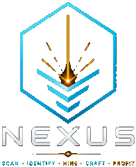
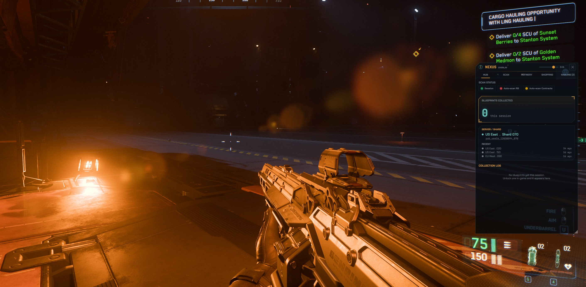
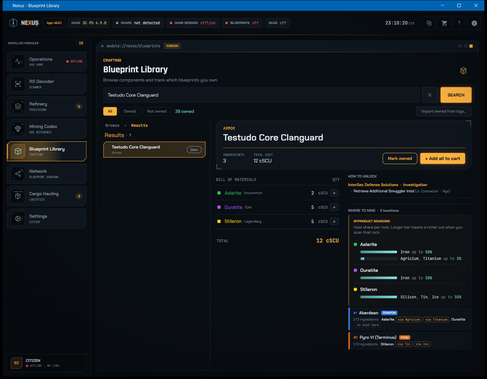
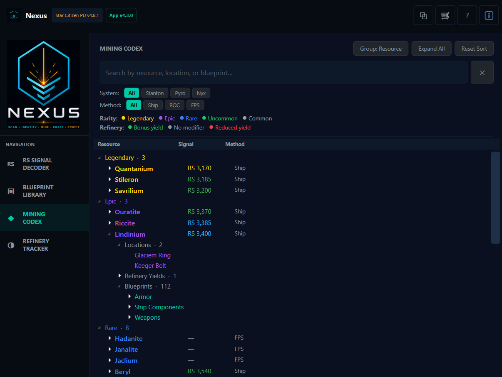
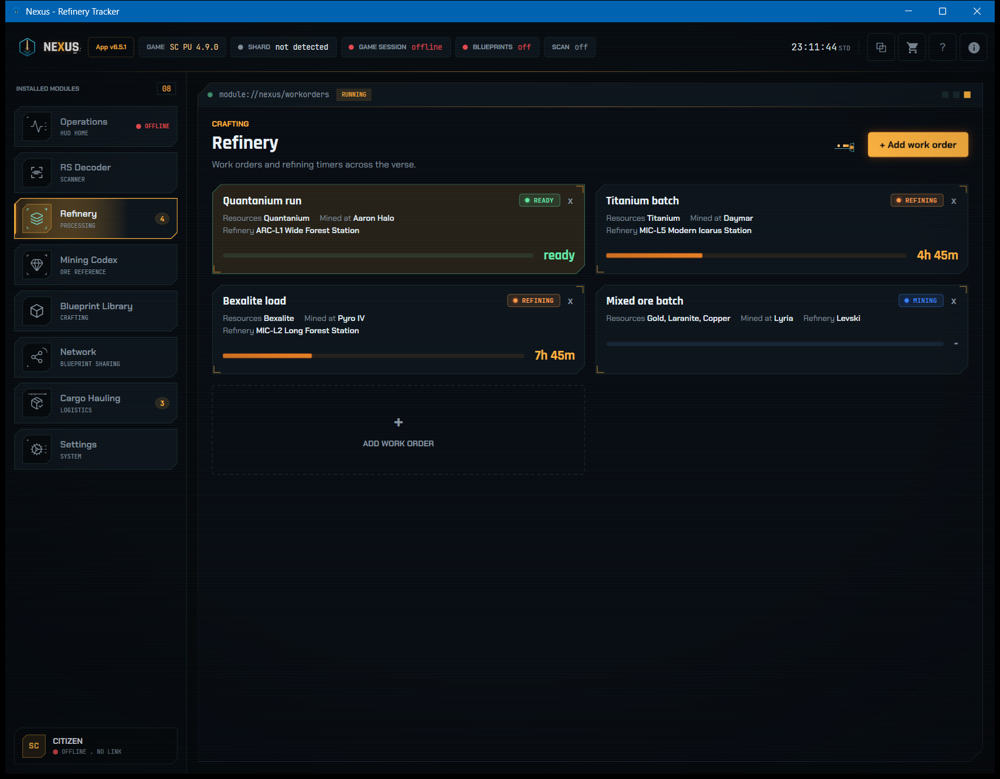

# Nexus — Star Citizen Mining Assistant

<p align="center">
  
</p>

Nexus is a lightweight Windows desktop companion for mining in **Star Citizen**. It decodes RS (Radioactive Signal) scan values into the resource and node count they represent, tracks refinery jobs, and gives you a fast, searchable reference for resources and crafting blueprints — all from an overlay that floats over your game.

> **Disclaimer**
> Nexus is an **unofficial, fan-made tool**. It is **NOT** affiliated with, endorsed by, or sponsored by Cloud Imperium Games (CIG) or Roberts Space Industries (RSI). Star Citizen is a trademark of CIG.
>
> Nexus reads pixel data from your screen and serves reference information from a **local database only**. It does **not** read game memory, inject code, or modify game files. It is **EAC-safe** (Easy Anti-Cheat compatible) and runs entirely outside the game process.

## Features

| Page | What it does |
|------|--------------|
| **RS Signal Decoder** | Manually enter or **auto-scan** an RS value to identify the resource and node count. |
| **Blueprint Library** | Search ship / weapon / armor blueprints and see the raw resources each one requires. |
| **Mining Codex** | Full reference table of all mineable resources, filterable by system (Stanton / Pyro / Nyx) and method (Ship / ROC / FPS). |
| **Refinery Tracker** | Track active refinery jobs with live countdown timers and status indicators. |

**Highlights**

- **Auto-scan overlay** — draw a region over the RS value on your screen and Nexus reads it automatically using the native Windows OCR engine.
- **Floating overlay** that sits over the game and can be repositioned and dimmed to taste.
- **Shopping list** — add resources or blueprint ingredients and have them highlighted in scan results and history.
- **Persistent work orders** — refinery timers survive app restarts.
- Fully **offline** — no account, no internet connection required. Settings and work orders are stored locally on your PC.

## Screenshots

### Auto-scan overlay
The floating overlay sits over Star Citizen and reads the RS value straight off your screen, decoding the resource and node count in real time. Here it's identified an **RS 10,800** signal as **Bexalite**, with live scan history below.

[](docs/screenshots/overlay.jpg)

### Blueprint Library
Search any ship, weapon, or armor blueprint to see exactly what it takes to craft — the raw resources and quantities, where to mine them, and the missions that unlock it.

[](docs/screenshots/blueprint-library.png)

### Mining Codex
A full reference of every mineable resource — grouped by rarity, searchable, and filterable by star system (Stanton / Pyro / Nyx) and mining method (Ship / ROC / FPS).

[](docs/screenshots/mining-codex.png)

### Refinery Tracker
Track active refinery jobs with live countdown timers and status indicators, so you always know what's cooking and when it's ready to collect.

[](docs/screenshots/refinery-tracker.png)

## Installation (end users)

Nexus ships two ways — pick whichever suits you. Both are self-contained (the .NET runtime is bundled), need **no admin rights**, store settings/work orders locally, and run fully offline.

### Option 1 — Installer (`Nexus_Setup.exe`) — *recommended, user friendly*

A guided setup that installs Nexus like normal Windows software.

1. Download **`Nexus_Setup.exe`** from the [Releases](../../releases) page.
2. Right-click it → **Properties** → check **Unblock** at the bottom → **OK**.
3. Run it and follow the prompts (optionally tick "Create a desktop shortcut").
4. Launch Nexus from the Start menu or desktop.

**Pros**
- Creates Start-menu and optional desktop shortcuts for you
- Clean uninstall from *Add or remove programs*
- Installs per-user under `%LOCALAPPDATA%` — still no admin rights
- Simplest path for non-technical users

**Cons**
- Writes files to `%LOCALAPPDATA%\Nexus` and registers an uninstaller
- One extra install step compared with just running the exe
- Updating means re-running a newer installer

### Option 2 — Portable (standalone `NexusApp.exe`)

Run the app directly, with no installation.

1. Download **`NexusApp_portable.zip`** from the [Releases](../../releases) page.
2. Right-click the ZIP → **Properties** → check **Unblock** at the bottom → **OK**.
3. Right-click the ZIP → **Extract All…** and choose a location (Desktop or Documents is fine).
4. Open the extracted folder and double-click **`NexusApp.exe`**.

**Pros**
- No installation and no admin rights
- Everything lives in one folder — nothing is written to the registry
- Leaves no system traces; delete the folder to remove it completely
- Easy to move between PCs or run from a USB stick

**Cons**
- No Start-menu or desktop shortcut — you launch it from the folder
- No entry in *Add or remove programs*
- Updating means downloading and replacing the folder yourself
- Keep the whole folder together — `NexusApp.exe` needs the files beside it

> **Windows SmartScreen note (applies to both options):** the app is unsigned (code-signing certificates cost several hundred dollars a year), so Windows may show a blue *"Windows protected your PC"* dialog on first run. Click **More info → Run anyway**, or use the **Unblock** step above. If Defender flags it, that's a false positive for an unsigned app.

<details>
<summary><strong>For developers — tech stack & project layout</strong></summary>

**Tech stack**

- **C# / .NET 8** with **WPF** (Windows-only, self-contained `win-x64` build)
- **CommunityToolkit.Mvvm** for MVVM
- **Microsoft.Data.Sqlite** for local storage
- **Windows.Media.Ocr** (native WinRT OCR engine) for the auto-scan feature

**Project layout**

```
NexusApp/
├─ NexusApp.sln
├─ nexus_installer.iss          # Inno Setup installer recipe
└─ NexusApp/
   ├─ Assets/                   # Icons and logos
   ├─ Converters/               # WPF value converters
   ├─ Data/seed_data.json       # Bundled mining/blueprint reference data
   ├─ Models/                   # Domain models
   ├─ Services/                 # OCR, scanning, data, settings
   ├─ ViewModels/               # MVVM view models
   ├─ Views/                    # Windows, dialogs, overlay
   └─ Themes/                   # Game-styled WPF theme
```

</details>

## Support & Feedback

Nexus is built by one person for the mining community, and hearing from people who use it is the best part. **If you enjoy the app, please reach out and say so — it genuinely makes a difference.**

Got a bug, a feature idea, or just want to share how Nexus is working for you? **Message T3SoD on Discord** (or catch **TurboV1RG1N** in game). All feedback — good, bad, or wishlist — is welcome and helps shape where Nexus goes next.

## License

Released under the [MIT License](LICENSE).
