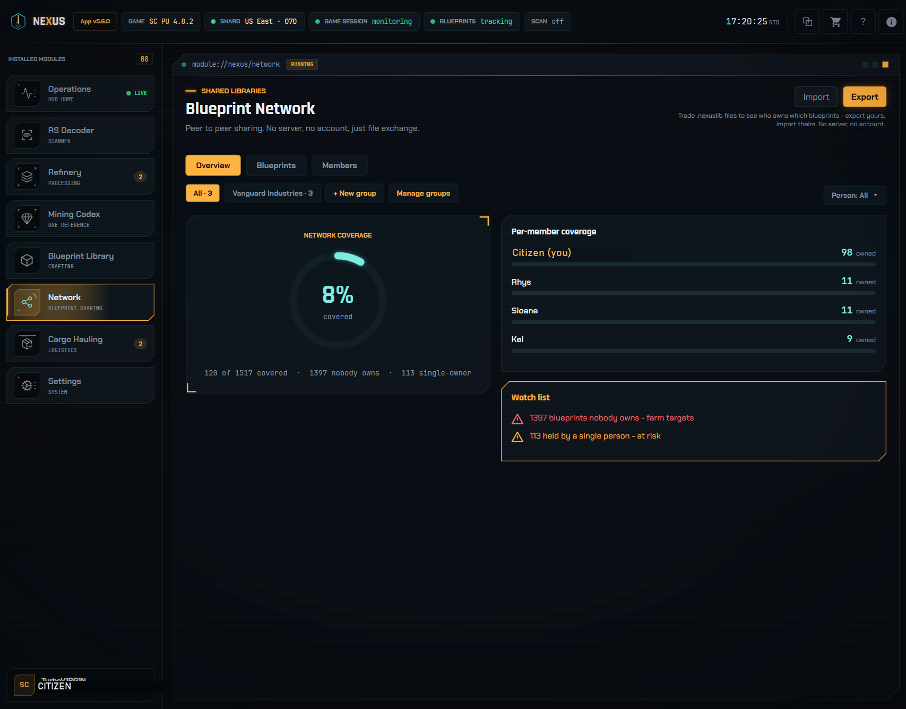

# Nexus — Star Citizen Companion App

<p align="center">
  
</p>

**An offline, EAC-safe companion app for Star Citizen, built for the mine · refine · craft loop.**

Nexus decodes RS (Radioactive Signal) scan values into the resource and node count they represent, tracks refinery jobs, and works as a fast, searchable reference for resources, crafting blueprints, and the blueprints you own. It can also read your game log to auto-collect blueprints the moment you unlock them in-game (Beta), all from an overlay that floats over your game while staying **fully offline**. With the **Blueprint Network**, you can pool your owned-blueprint library with friends or your org by trading files, so your whole group can see who owns what.

> **Disclaimer:** Nexus is an unofficial, fan-made tool. It is **not** affiliated with, endorsed by, or sponsored by Cloud Imperium Games (CIG) or Roberts Space Industries (RSI). Star Citizen is a trademark of CIG.

## How Nexus stays EAC-safe

Nexus runs entirely **outside** Star Citizen. It sits beside the game like a second monitor and never reaches into it.

- **Screen only:** Nexus reads your screen using the standard Windows screen-capture and OCR APIs (the same ones screenshot tools use). It never reads Star Citizen's memory.
- **No injection:** no DLLs, no hooks, nothing loaded into the game process. Nexus is a separate window.
- **No game files modified:** Nexus never writes to or alters any Star Citizen file; its reference data comes from a local database bundled with the app. The optional **Session Tracking** feature *reads* the plain-text logs the game writes to disk (`Game.log` and its rotated backups), read-only and opened shared so it never locks them, to detect blueprints you've unlocked. It may also read the game's `global.ini` localization file (read-only) to translate mod-renamed blueprint names back to ones it recognizes. The **Blueprint Network** feature additionally reads your RSI handle from `Game.log` (read-only) to pre-fill a shared-library export; you can use a nickname instead, and nothing is shared unless you export a file yourself. It never reads the game's memory or process, and never touches the packed game data (`.p4k`).
- **No admin, no network:** it installs per-user, needs no elevation, and runs fully offline. Verify it yourself with a firewall.
- **Open source:** the entire OCR pipeline is in this repo. Read it for yourself.

The result: there's nothing for Easy Anti-Cheat to flag.

## Features

| Page | What it does |
|------|--------------|
| **RS Signal Decoder** | Manually enter or **auto-scan** an RS value to identify the resource and node count. |
| **Blueprint Library** | Search ship / weapon / armor / ammo blueprints and see the raw resources each one requires. Mark which blueprints you own and filter by owned / not owned. |
| **Blueprint Network** | Share which blueprints you own with friends or your org by trading library files, and see who in your group owns what — coverage, gaps to farm, and single-owner risk. Fully offline: you exchange files, nothing syncs. |
| **Mining Codex** | Full reference table of all mineable resources, filterable by system (Stanton / Pyro / Nyx) and method (Ship / ROC / FPS). |
| **Refinery Tracker** | Track active refinery jobs with live countdown timers and status indicators. |

**Highlights**

- **Auto-scan overlay:** draw a region over the RS value on your screen and Nexus reads it automatically using the native Windows OCR engine.
- **Floating overlay** that sits over the game and can be repositioned and dimmed to taste.
- **Blueprint ownership tracking:** mark which blueprints you own, filter the library by owned / not owned, and track your collection completion per category, so you don't have to check in-game.
- **Session Tracking (Beta):** opt in and Nexus reads your Star Citizen `Game.log` to mark blueprints Owned automatically the moment you receive them in-game, or import everything you've already unlocked from past logs. It is read-only and never writes to or modifies any game file.
- **Blueprint Network:** pool your owned-blueprint library with friends or your org by trading files to see group coverage, gaps, and single-owner risk. Full details in the Blueprint Network section below.
- **Shopping list:** add resources or blueprint ingredients and have them highlighted in scan results and history.
- **Persistent work orders:** refinery timers survive app restarts.
- Fully **offline:** no account or internet connection required. Settings and work orders are stored locally on your PC.

## Blueprint Network — share your library, see who owns what

Most companion tools only track *your* data. **Blueprint Network** adds an offline way to pool blueprint libraries with your friends or your org. Export your owned blueprints to a small file, send it however you like (Discord, a shared drive), and import theirs. You then see your whole group's coverage at a glance: what everyone owns, the gaps nobody has yet, and the blueprints only a single person holds. Filter the view to any one person to see exactly what they own or are missing, group people into Friends/org lists, and let a coordinator merge everyone into a single roster the group imports once. There is no server and no account; you move the files yourself, and nothing leaves your PC unless you choose to share it.

## Screenshots

### Auto-scan overlay
The floating overlay sits over Star Citizen and reads the RS value straight off your screen, decoding the resource and node count in real time. Here it's identified an **RS 11,700** signal as **Torite** (RS 3,900 x3 nodes), with live scan history below.

[](docs/screenshots/overlay.jpg)

### Blueprint Library
Search any ship, weapon, or armor blueprint to see exactly what it takes to craft: the raw resources and quantities, where to mine them, and the missions that unlock it.

[](docs/screenshots/blueprint-library.png)

### Blueprint Network
Group coverage view: blueprints owned across the group, the gaps nobody owns yet, and single-owner blueprints flagged as at-risk.

[](docs/screenshots/blueprint-network.png)

### Mining Codex
A full reference of every mineable resource, grouped by rarity, searchable, and filterable by star system (Stanton / Pyro / Nyx) and mining method (Ship / ROC / FPS).

[](docs/screenshots/mining-codex.png)

### Refinery Tracker
Track active refinery jobs with live countdown timers and status indicators, so you always know what's refining and when it's ready to collect.

[](docs/screenshots/refinery-tracker.png)

## Installation (end users)

Nexus ships two ways; pick whichever suits you. Both are self-contained (the .NET runtime is bundled), need **no admin rights**, store settings and work orders locally, and run fully offline.

### Option 1 — Installer (`Nexus_Setup.exe`) — *recommended, user friendly*

A guided setup that installs Nexus like normal Windows software.

1. Download **`Nexus_Setup.exe`** from the [Releases](../../releases) page.
2. Right-click it → **Properties** → check **Unblock** at the bottom → **OK**.
3. Run it and follow the prompts (optionally tick "Create a desktop shortcut").
4. Launch Nexus from the Start menu or desktop.

**Pros**
- Creates Start-menu and optional desktop shortcuts for you
- Clean uninstall from *Add or remove programs*
- Installs per-user under `%LOCALAPPDATA%` — still no admin rights
- Simplest path for non-technical users

**Cons**
- Writes files to `%LOCALAPPDATA%\Nexus` and registers an uninstaller
- One extra install step compared with just running the exe
- Updating means re-running a newer installer

### Option 2 — Portable (standalone `NexusApp.exe`)

Run the app directly, with no installation.

1. Download **`NexusApp_portable.zip`** from the [Releases](../../releases) page.
2. Right-click the ZIP → **Properties** → check **Unblock** at the bottom → **OK**.
3. Right-click the ZIP → **Extract All…** and choose a location (Desktop or Documents is fine).
4. Open the extracted folder and double-click **`NexusApp.exe`**.

**Pros**
- No installation and no admin rights
- Everything lives in one folder — nothing is written to the registry
- Leaves no system traces; delete the folder to remove it completely
- Easy to move between PCs or run from a USB stick

**Cons**
- No Start-menu or desktop shortcut — you launch it from the folder
- No entry in *Add or remove programs*
- Updating means downloading and replacing the folder yourself
- Keep the whole folder together — `NexusApp.exe` needs the files beside it

> **Windows SmartScreen note (applies to both options):** the app is unsigned (code-signing certificates cost several hundred dollars a year), so Windows may show a blue *"Windows protected your PC"* dialog on first run. Click **More info → Run anyway**, or use the **Unblock** step above. If Defender flags it, that's a false positive for an unsigned app.

<details>
<summary><strong>For developers — tech stack & project layout</strong></summary>

**Tech stack**

- **C# / .NET 8** with **WPF** (Windows-only, self-contained `win-x64` build)
- **CommunityToolkit.Mvvm** for MVVM
- **Microsoft.Data.Sqlite** for local storage
- **Windows.Media.Ocr** (native WinRT OCR engine) for the auto-scan feature

**Project layout**

```
NexusApp/
├─ NexusApp.sln
├─ nexus_installer.iss          # Inno Setup installer recipe
└─ NexusApp/
   ├─ Assets/                   # Icons and logos
   ├─ Converters/               # WPF value converters
   ├─ Data/seed_data.json       # Bundled mining/blueprint reference data
   ├─ Models/                   # Domain models
   ├─ Services/                 # OCR, scanning, data, settings
   ├─ ViewModels/               # MVVM view models
   ├─ Views/                    # Windows, dialogs, overlay
   └─ Themes/                   # Game-styled WPF theme
```

</details>

## Support & Feedback

Nexus is built by one person for the mining community, and hearing from people who use it is the best part. If you enjoy the app, please reach out and say so.

Got a bug, a feature idea, or want to share how Nexus is working for you? **Message T3SoD on Discord** or **[open an issue on GitHub](https://github.com/T3SoD/NexusApp/issues)**. All feedback is welcome and helps shape where Nexus goes next.

When reporting a bug, you can attach a diagnostic snapshot: open **Settings** (the cog) → **Diagnostics** → **Open App Log Monitor**, then **Save snapshot** to bundle your app version, OS, and recent log into a single file.

## License

Released under the [MIT License](LICENSE).
