# Nexus - Star Citizen Companion App

<p align="center">
  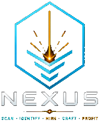
</p>

<p align="center">
  <picture>
    <source media="(prefers-color-scheme: dark)" srcset="docs/made-by-the-community-white.png">
    
  </picture>
</p>

**Nexus is an offline-by-default, EAC-safe companion app for the mine, refine, craft, and haul loop in Star Citizen.**

Nexus decodes RS scan values into a resource type and a node count. It times your refinery jobs. It also works as a searchable reference for resources, blueprints, and the blueprints that you own.

Nexus reads `Game.log` as you play. It auto-collects blueprints the moment that you unlock them. It merges your accepted hauling contracts into one consolidated route of pickup stops and delivery stops. It also shows your pilot handle and your recent server shards. An overlay shows all of this and floats over the game. None of this needs an internet connection.

The **Blueprint Network** adds ownership tracking for friends or your org. You trade library files, and then everyone sees who owns what.

> **Disclaimer:** Nexus is an unofficial, fan-made tool. Nexus has no affiliation with Cloud Imperium Games (CIG) or Roberts Space Industries (RSI). CIG and RSI do not endorse or sponsor Nexus. Star Citizen®, Roberts Space Industries® and Cloud Imperium® are registered trademarks of Cloud Imperium Rights LLC.

> **EAC-safe by design:** Nexus runs fully outside Star Citizen. It does not inject code. It does not read memory. It does not modify game files.
>
> Nexus does only two kinds of operation on the game. It captures your screen with the standard Windows OCR APIs. It reads the plain-text `Game.log` that the game writes to disk, and the `global.ini` localization file when one is present. It opens both as read-only and in shared mode.
>
> Nexus installs per-user. It makes no network calls unless you turn on one of two optional online features: update checks (contacts GitHub only: github.com and GitHub's own file-download host) or live market prices (contacts UEX's community API at api.uexcorp.uk). Both features stay off until you say yes. The whole pipeline is open source in this repo. Easy Anti-Cheat has nothing to flag.

## Features

| Page | What it does |
|------|--------------|
| **Operations** | The landing dashboard. It shows your last scan, the refinery queue, cargo in transit, session blueprints, and network coverage. It links to every module. |
| **Mission Guides** | Zoomable maps and tactical reference guides, built into the app. The viewer zooms to your cursor, drags to pan, and double-clicks back to a full fit. The contested zone section shows the executive hangar lights and a live countdown. |
| **RS Signal Decoder** | Enter an RS value by hand, or use **auto-scan**. Nexus identifies the resource and the node count. Each result card shows a CAN CONTAIN section and the best refinery station for the yield. |
| **Refinery Tracker** | Track your active refinery jobs. Nexus shows live countdown timers and status indicators. |
| **Mining Codex** | A full reference table of all mineable resources. Filter it by system (Stanton / Pyro / Nyx) and by method (Ship / ROC / FPS). Open an ore to see full details: its class, a ship-mining profile, its rock composition, and byproduct sourcing. |
| **Blueprint Library** | Search ship, weapon, armor, and ammo blueprints. See the raw resources that each one needs, the contracts that unlock it, a ranked WHERE TO MINE plan, and byproduct sourcing. Mark the blueprints that you own. Filter by owned or not owned. Import your collection from an SCMDB export file, with a preview before anything applies. |
| **Blueprint Network** | Share the blueprints that you own with friends or your org. Trade library files to do this. See who in your group owns what: coverage, the gaps to farm, and single-owner risk. Blueprint Network works fully offline. You exchange files, and nothing syncs. |
| **Cargo Hauling** | The hauling contracts that you accept in-game appear automatically from `Game.log`. Nexus consolidates them into collect stops and deliver stops for each location. An optional screen-scan adds the reward, the contractor, and the cargo details to each haul. |

**Highlights**

- **Auto-scan overlay:** Draw a region over the RS value on your screen. Nexus then reads the value automatically with the native OCR engine in Windows.
- **Overlay:** The overlay floats over the game with six tabs: HUB, SCAN, REFINERY, SHOPPING, HAULING, and GUIDES. Each tab is an icon, and the active tab expands into an amber pill with its name. A gear in the header opens quick settings in-game: ghost mode, click-through, opacity, and rail size. The overlay passes your mouse through to the game when Star Citizen hides the cursor in flight or on foot. You can turn this off in Settings. The HUB tab shows hero tiles for ready refinery orders and your haul totals.
- **Ghost mode:** One toggle collapses the overlay to a slim icon rail. Click a glyph to slide that tab out beside the rail. Click the glyph again to collapse back. You can size the rail on its own, from 75% to 150%, separate from the panels.
- **Mission Guides:** Browse zoomable maps and tactical reference guides on the Mission Guides page and in the overlay GUIDES tab. The contested zone guides show the executive hangar lights and a live open-close countdown. All guides ship inside the app, fully offline.
- **Blueprint ownership tracking:** Mark the blueprints that you own. Filter the library by owned or not owned. Track your collection completion for each category. Then you do not need to check in-game. You can also import the blueprints that you own from an SCMDB export file. A preview shows exactly which blueprints will be marked owned before anything applies.
- **Session Tracking:** Nexus reads your Star Citizen `Game.log`. It marks blueprints as Owned automatically the moment that you receive them in-game. It can also import everything that you already unlocked from past logs. Session Tracking is always on and read-only. It never writes to or modifies any game file.
- **Cargo Hauling:** Accepted contracts appear on their own. Nexus makes a consolidated collect-and-deliver plan across all active hauls. It tracks the live shard. It cleans up automatically when you change shards.
- **Guided tour and built-in user guide:** A welcome tour guides new users through Nexus. You can replay the tour anytime from Help. A searchable help guide covers every module.
- **Blueprint Network:** Pool your owned-blueprint library with friends or your org. Trade files to see group coverage, gaps, and single-owner risk. See the full details in the Blueprint Network section below.
- **Shopping list:** Add resources or blueprint ingredients. Nexus then highlights them in scan results and history.
- **Persistent work orders:** Refinery timers survive when Nexus restarts.
- **Crash recovery:** If Windows reports a display error, Nexus restarts itself once and shows a notice on the Operations dashboard. Your work orders and hauls are safe. The Diagnostics section in Settings has a CPU rendering toggle and a row for the last automatic restart.
- **Offline by default:** You do not need an account. Nexus makes no network calls unless you enable one of two optional online features (update checks or live market prices). Nexus stores settings and work orders locally on your PC.
- **Opt-in updates:** Nexus asks once whether it can check GitHub for new versions. If you say yes, it checks when Nexus starts, at most once a day, verifies every download, and asks before it installs anything.
- **Opt-in live market prices:** Nexus asks once whether it can show live sell prices from UEX, a community-run price database. If you say yes, Nexus fetches prices about once an hour while it is open and caches them locally, so prices still show when you are offline. Prices show on the RS Signal Decoder, the Mining Codex, the Refinery Tracker, and the overlay scan cards. An optional sell column in the Mining Codex list compares ores at a glance. UEX prices are community-reported and can be stale; Nexus marks the age of each price rather than presenting it as guaranteed-current.
- **Interface scale:** Grow the whole app and the overlay independently, from 100% to 150%, for high-resolution displays.

## Screenshots

### Operations
The landing dashboard. It shows the last scan decoded, the refinery queue with one order ready, cargo in transit, and the recent server shards. It links to every module.

[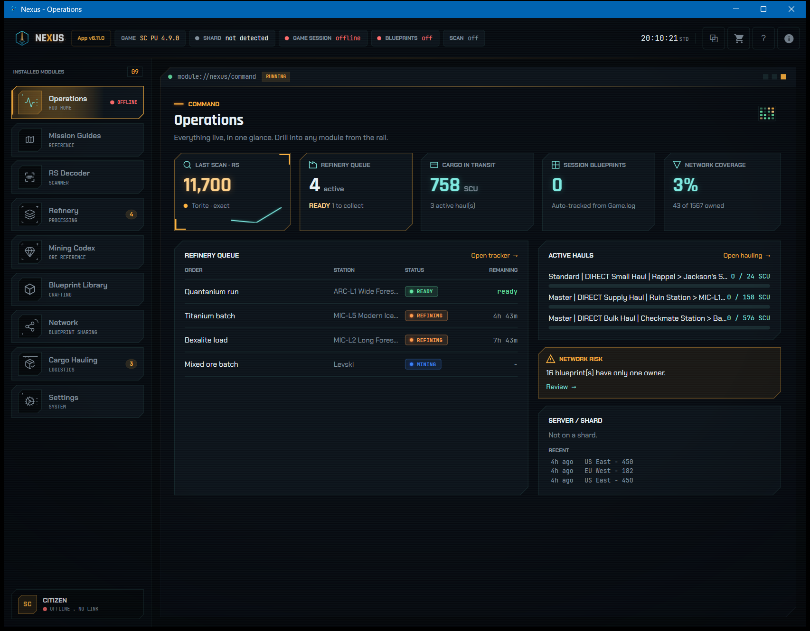](docs/screenshots/operations.png)

### Mission Guides
Zoomable maps and tactical reference guides, built into the app. The contested zone header shows the executive hangar lights and a live countdown. Open a guide to zoom with the scroll wheel and drag to pan.

[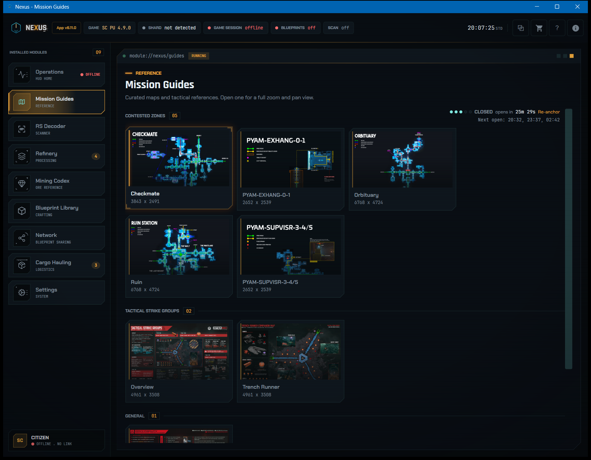](docs/screenshots/mission-guides.png)

### Auto-scan, in the cockpit
The overlay SCAN tab sits over Star Citizen during mining. The detection box surrounds the in-game RS readout. Nexus decodes the value live: it identifies **RS 11,700** as **Torite** (RS 3,900 x3 nodes, exact). The scan history fills in below.

[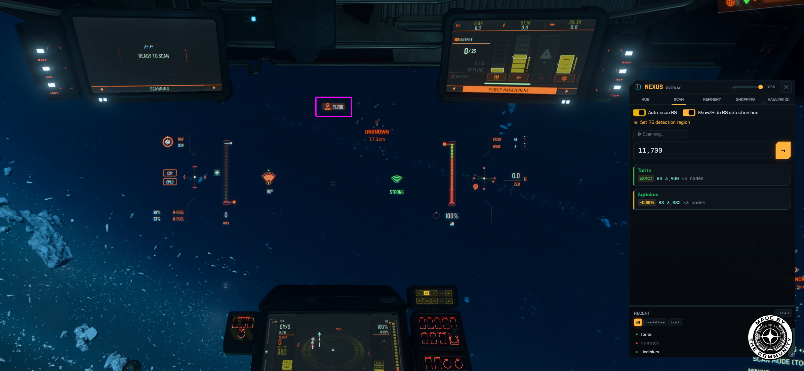](docs/screenshots/overlay-scan.png)

### Overlay HUB over the game
The HUB tab floats over gameplay. It shows green status lights for session tracking and both scanners, the blueprints collected this session, and your current server and shard. Everything is read-only.

[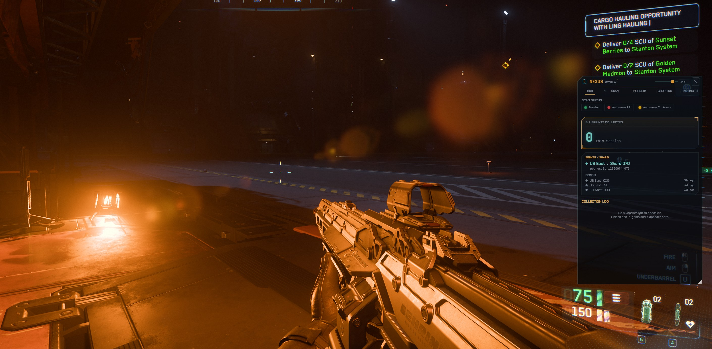](docs/screenshots/overlay.jpg)

### RS Signal Decoder
Type any RS value to get a ranked breakdown. The best match shows as a hero card with the node count, the best refinery, and what the rock can contain. Close matches show below. The re-runnable scan history shows on the right.

[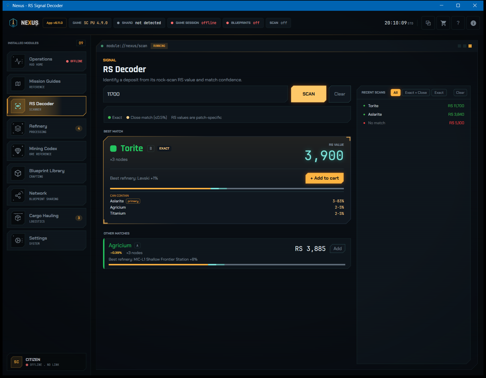](docs/screenshots/rs-decoder.png)

### Blueprint Library
Open any blueprint to see its full bill of materials and the contracts that unlock it. It also shows a ranked WHERE TO MINE plan and byproduct sourcing for the ingredients. Track everything that you own, or import your collection from an SCMDB export file.

[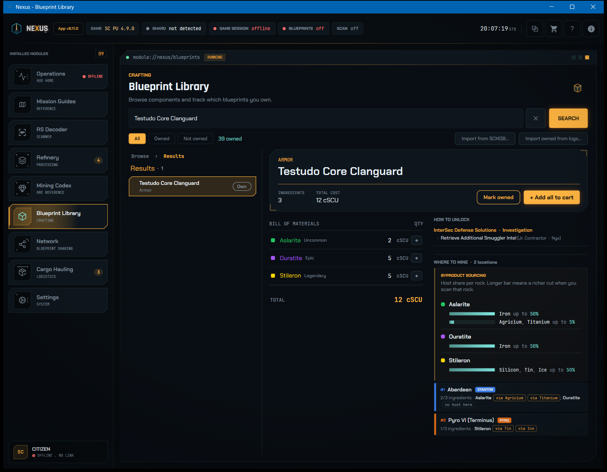](docs/screenshots/blueprint-library.png)

### Blueprint Network
Group coverage: the coverage ring, per-member ownership, and a watch list. The watch list shows the gaps that nobody owns yet and the single-owner blueprints at risk.

[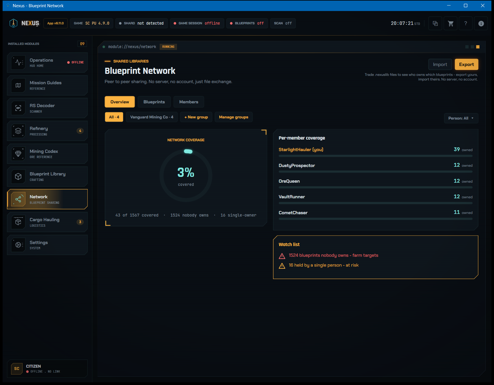](docs/screenshots/blueprint-network.png)

### Mining Codex
A full reference of every mineable resource. It is searchable. Filter it by star system (Stanton / Pyro / Nyx) and by mining method (Ship / ROC / FPS). A detail dossier leads with the value section: the refinery yields, and the best sell price when market data is on. It also shows the mining profile, the rock composition, byproduct sourcing, locations, and the blueprints that use it.

[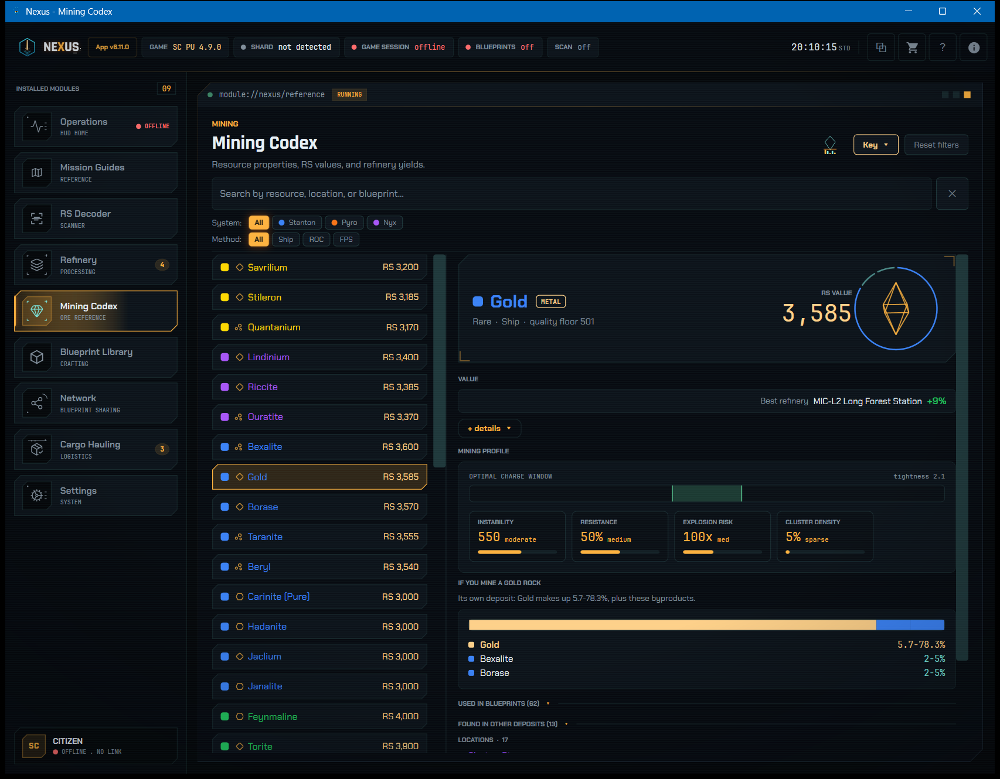](docs/screenshots/mining-codex.png)

### Refinery Tracker
Live work orders show as cards. One is ready to collect. Two are mid-refine, and their countdowns run. The timers survive when Nexus restarts.

[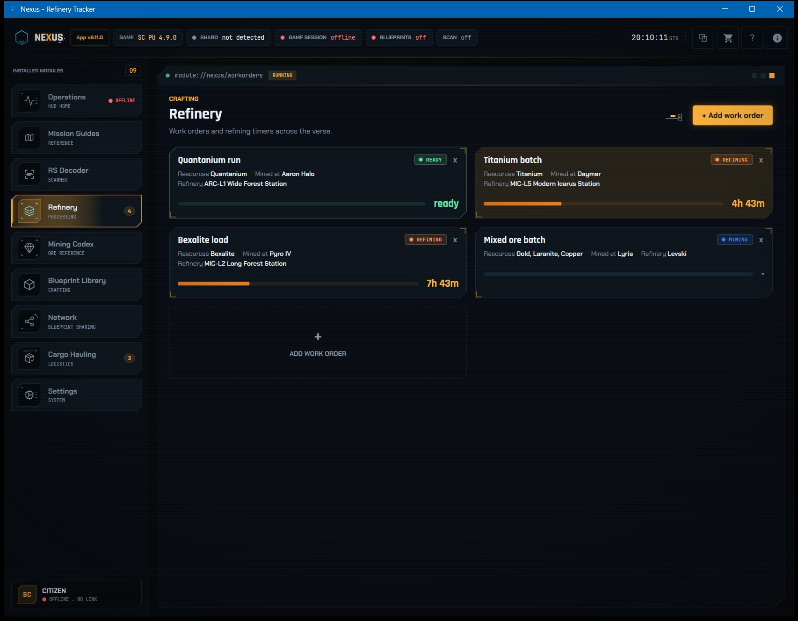](docs/screenshots/refinery-tracker.png)

### Cargo Hauling
Nexus tracks three live contracts automatically from `Game.log`, with the container size for each. The consolidated collect and deliver table turns every leg into one route plan for each location.

[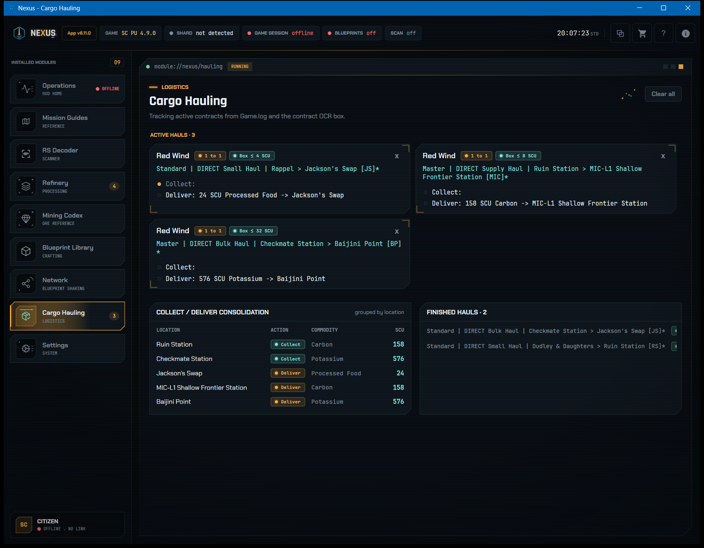](docs/screenshots/cargo-hauling.png)

### Overlay HAULING tab
The same haul plan appears in-game. It shows totals, consolidated stops, and per-contract progress. You do not need to leave the pilot seat.

[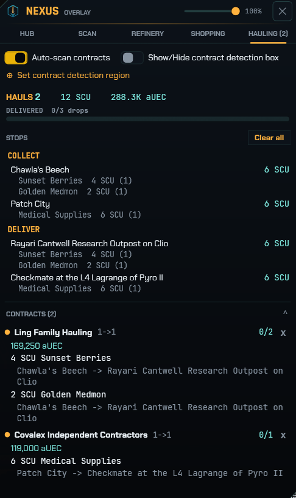](docs/screenshots/overlay-hauling.png)

## Installation (end users)

Nexus comes in two forms. Choose the one that suits you. Both forms are self-contained, because Nexus bundles the .NET runtime. Both need no admin rights. Both store settings and work orders locally. Both run offline unless you turn on optional online features (update checks, live market prices).

### Option 1 - Installer (`Nexus_Setup.exe`) - *recommended, user friendly*

A guided setup installs Nexus like normal Windows software.

1. Download **`Nexus_Setup.exe`** from the [Releases](../../releases) page.
2. Right-click `Nexus_Setup.exe`.
3. Select **Properties**.
4. Check **Unblock** at the bottom of the dialog.
5. Click **OK**.
6. Run `Nexus_Setup.exe`.
7. Follow the prompts.
8. Optional: to make a desktop shortcut, select **Create a desktop shortcut**.
9. Open Nexus from the Start menu or the desktop.

### Option 2 - Portable (standalone `NexusApp.exe`)

Run Nexus directly. You do not need to install it.

1. Download **`NexusApp_portable.zip`** from the [Releases](../../releases) page.
2. Right-click `NexusApp_portable.zip`.
3. Select **Properties**.
4. Check **Unblock** at the bottom of the dialog.
5. Click **OK**.
6. Right-click `NexusApp_portable.zip` again.
7. Select **Extract All…**.
8. Choose a location, for example the Desktop or Documents.
9. Open the extracted folder. Then open the **NexusApp** folder inside it.

**Caution:** Keep all the files in the NexusApp folder together.

10. Double-click **`NexusApp.exe`** to start Nexus.

> **Windows SmartScreen note (applies to both options):** Nexus is unsigned. Code-signing certificates cost several hundred dollars a year. Because Nexus is unsigned, Windows can show a blue *"Windows protected your PC"* dialog on the first run. To continue, click **More info**, then click **Run anyway**. You can also use the **Unblock** step above. If Defender flags Nexus, this is a false positive for an unsigned app.

### Updating

Nexus can check for new versions itself. The first time you run a version that supports it, Nexus asks once whether to enable update checks (Settings > Updates has the toggle and a manual Check now button; nothing is contacted until you say yes or click Check now yourself).

- **Installer:** when an update is available, Nexus offers to download it, verifies the download, and runs the installer for you. Your settings, work orders, and blueprints are kept.
- **Portable:** Nexus installs the update itself. It downloads and verifies the new portable zip, unpacks it, verifies each file, replaces its own files, and restarts as the new version. Your settings, work orders, and blueprints are kept. If Nexus cannot replace its own files where it is installed, it offers a manual update instead. Nexus then unpacks the update and opens both folders, and you finish with one copy.

Every download and install asks first. You can always update by hand from the [Releases](../../releases) page instead.

<details>
<summary><strong>For developers - tech stack and project layout</strong></summary>

**Tech stack**

- **C# / .NET 8** with **WPF** (Windows-only, self-contained `win-x64` build)
- **CommunityToolkit.Mvvm** for MVVM
- **Microsoft.Data.Sqlite** for local storage
- **Windows.Media.Ocr** (native WinRT OCR engine) for the auto-scan feature
- **Microsoft.Web.WebView2** for one beta 3D view (local, bundled content only; no external navigation)

**Project layout**

```
NexusApp/
├─ nexus_installer.iss          # Inno Setup installer recipe
└─ NexusApp/
   ├─ Assets/                   # Icons and logos
   ├─ Converters/               # WPF value converters
   ├─ Data/seed_data.json       # Bundled mining/blueprint reference data
   ├─ Models/                   # Domain models
   ├─ Services/                 # OCR, scanning, data, settings
   ├─ ViewModels/               # MVVM view models
   ├─ Views/                    # Windows, dialogs, overlay
   ├─ Web/                      # Vendored web content for the WebView2 view
   └─ Themes/                   # Game-styled WPF theme
```

The `NexusApp.Tests` project holds the xUnit test suite.

</details>

## Support & Feedback

One person builds Nexus for the mining community. Feedback from people who use Nexus is welcome. If you like Nexus, please contact me.

You can report a bug, suggest a feature, or tell me how Nexus works for you. **Message T3SoD on Discord** or **[open an issue on GitHub](https://github.com/T3SoD/NexusApp/issues)**. All feedback is welcome. It helps to shape the future of Nexus.

When you report a bug, you can attach a diagnostic snapshot. To make a snapshot, do these steps:

- Open the **Settings** module at the bottom of the app dock.
- Select **Diagnostics**.
- Select **Open App Log Monitor**.
- Click **Save snapshot**.

The snapshot combines the Nexus version, your OS, and your recent log into one file.

## License

Nexus uses the [MIT License](LICENSE).
